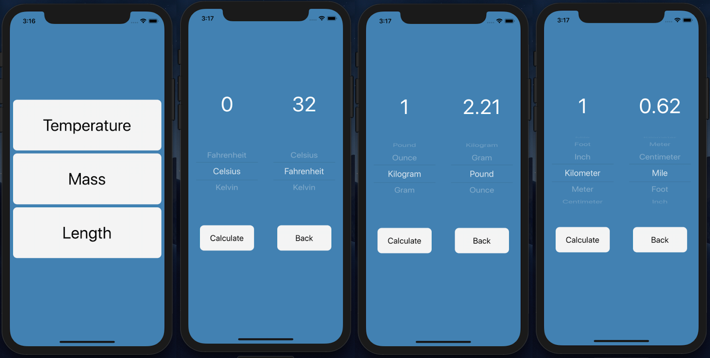

# Convertr

### Video Presentation:

Coming soon...

### Description:

Native app that allows users to convert temperature, mass, length, and currency units.

MVP completed in 2 days for a solo project.

### Tech Stack:

Built using React Native and utilizes the Free Forex API.

### Dev Team:

- Tal Luigi ([LinkedIn](https://www.linkedin.com/in/talluigi) | [GitHub](https://github.com/luigilegion))
